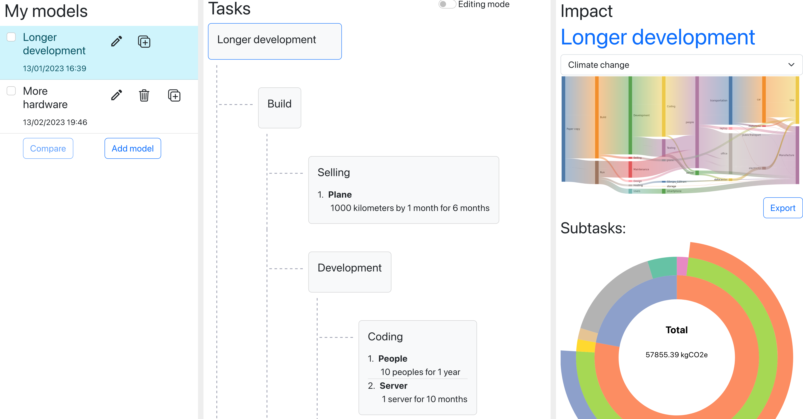

# Software life cycle environmental footprint

A web application to estimate the environmental footprint of a software development project's life cycle, over multiple categories.



## Publication

[Uncovering the Environmental Impact of Software Life Cycle](https://inria.hal.science/hal-04082263):
T. Simon, P. Rust, R. Rouvoy, and J. Penhoat, in International Conference on Information and Communications Technology for Sustainability (ICT4S), 2023

> The environmental footprint of a software service development may be impacted by several factors, spanning human factors to infrastructure choices. To the best of our knowledge, the state of the art in the domain of environmental footprint fails i) to address the full spectrum of software services life cycle, from design to operation and maintenance and ii) to cover different categories of impacts.
>
> In this context, we therefore introduce a methodology and the associated model to guide the software development ecosystem and their stakeholders in estimating the environmental footprint of their projects along multiple impact categories. This holistic approach delivers actionable insights to identify potential shifting between phases, such as development and usage, but also hotspots among resources consumed to produce and operate software services.
>
> Our tool emphasizes the importance of development impact on a software life cycle and shows the relative importance of phases, as well as resources consumed.

## Getting started

Run

```
docker-compose up --build
```

and access at [localhost](http://localhost/).

Or install separately the:

- [Frontend](./front/README.md)
- [Backend](./back/README.md)
