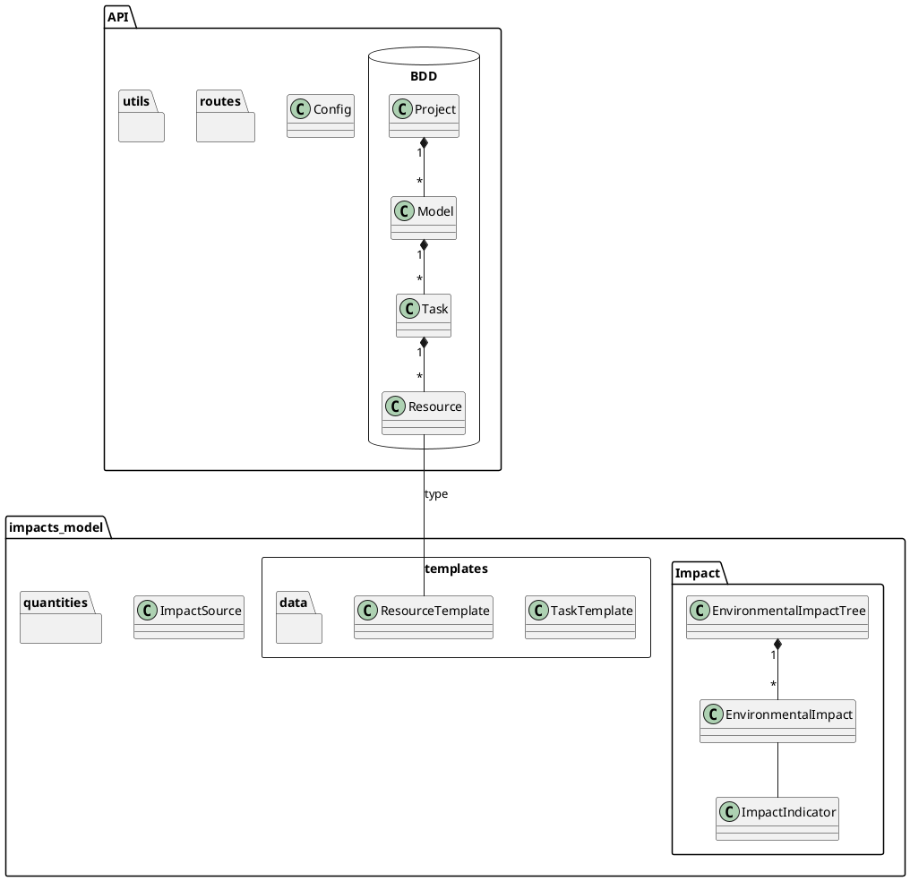

# Installation

```
python3-m venv venv
source venv/bin/activate
pip install -r requirements.txt
export FLASK_APP="api.server:create_app()"
flask run
```
Use `flask run --host=0.0.0.0 --port=5001` on the server.

# Architecture




## API
- Swagger
- Flask server (Flask application factory with config file for environments)
- Data_model and db: 
	-  Project, Model, Task, Resource objects and flask_marshmallow schemas
- Route package:
	- One file per api route root (model, project, task, task_template)
- Utils:
	- Helper to build and reset the database

## impacts_model:

- Task and resource templates:
	- Class and marshmallow schemas in templates.py
	- Data loaded from data folder
- Module quantities:  unit et alias pint
- impacts.py:
	- ImpactIndicator enumeration, the 10 impact indicators used in LCAs to show the impact of a product or service on the environment
	- EnvironmentalImpact class aggregates all ImpactIndicators with their corresponding (pint) quantity. Contains various methods to add impacts
- impact_sources.py:
	- Contains all sources of impact (laptop, car....) with their associated EnvironmentalImpact object
- computation.py
	- All impact modelling logic
	- Niveau task:
		- EnvironmentalImpact object with all impacts
		- Quantity for one ImpactIndicator
		- EnvironmentalImpactTree object with all impacts and those of its subtasks
		- ResourcesEnvironmentalImpact object, EnvironmentalImpact per resource type
	- Niveau resource:
		- EnvironmentalImpact object with all impacts
		- Quantity for one ImpactIndicator

**Api is linked to the model via Resource "type" field, which corresponds to a ResourceTemplate file name to retrieves its impact sources**
